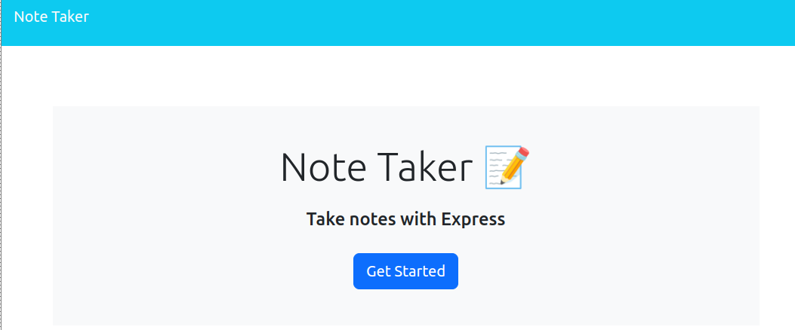
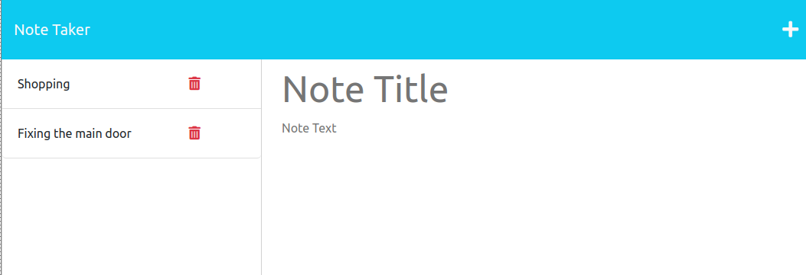

# Note Taker

## Description

- Deploy express application to the Heroku to be accessible to public

- Helping people to have their note availabe at all time

- a pretty note taker to keep track of the daily note

- express.js, software design and architecture, read and write to the file system, async/await and more

## Table of Contents

- [How To Use](#how-to-use)
- [Installation](#installation)
- [Acceptance_Criteria](#acceptance-criteria)
- [Helpful Heroku Resources](#helpful-heroku-resources)
- [How to Contribute](#how-to-contribute)

## How To Use

Link to deployed web page on ()



## Installation

```
node install && npm start
```

## User Story

```
AS A small business owner
I WANT to be able to write and save notes
SO THAT I can organize my thoughts and keep track of tasks I need to complete
```

## Acceptance Criteria

```
GIVEN a note-taking application
WHEN I open the Note Taker
THEN I am presented with a landing page with a link to a notes page
WHEN I click on the link to the notes page
THEN I am presented with a page with existing notes listed in the left-hand column, plus empty fields to enter a new note title and the note’s text in the right-hand column
WHEN I enter a new note title and the note’s text
THEN a Save icon appears in the navigation at the top of the page
WHEN I click on the Save icon
THEN the new note I have entered is saved and appears in the left-hand column with the other existing notes
WHEN I click on an existing note in the list in the left-hand column
THEN that note appears in the right-hand column
WHEN I click on the Write icon in the navigation at the top of the page
THEN I am presented with empty fields to enter a new note title and the note’s text in the right-hand column
```

## Helpful Heroku Resources

[Heroku documentation on getting started with Node.js](https://devcenter.heroku.com/articles/getting-started-with-nodejs?singlepage=true)

[Heroku documentation on creating a Heroku remote](https://devcenter.heroku.com/articles/git#creating-a-heroku-remote)

## How to Contribute

Challenges repository
This is an open source project which has Licensed by MIT which allow you to contribute and used open source codes used in this repo (All Branches).
More info: https://g.co/kgs/QWcHhF

- Branches are named as module[n] and each one of them its unique challenge.
- Master Branch contain the last solved challenge. (the read me your are reading trough, it is a defult guid when NO challage availabel to help you do a pre-setup.)

# how to use the module and deploy

- Clone the repo and make it own

  # Https url :

        git clone https://github.com/miladesmailpour/challanges.git

  # ssh url :

        git clone git@github.com:miladesmailpour/challanges.git

  # Checking the fetch/pull and push url :

        git remote -v

  # Modifing origin url :

        git remote add origin [https/ssh url of you repo] https://docs.github.com/en/get-started/quickstart/create-a-repo

  # Verifing the fetch/pull and push url :

        git remote -v https://docs.github.com/en/get-started/getting-started-with-git/managing-remote-repositories

  # Chacking the status of local :

        git status

        "if local NOT updated"
        git add .
        git commit -m "[your comment]"
        git push origin master/main

- Checkout to the module (the challenge you want to used and deploy)
  # Checkout to the disred challage :
       git checkout module[n]
  # Verifing :
       git status
  # [Make the change you wish to have]
       What do you think needed to improve?
  # Commiting to local and updating the GitHub repo:
         git add .
         git commit -m "[your comment]"
         git push origin [your module name]
- Moving Modules to Master Branch and deploy :
  # Creating a pull request to update the master/main :
       https://docs.github.com/en/pull-requests/collaborating-with-pull-requests/proposing-changes-to-your-work-with-pull-requests/creating-a-pull-request
  # Deploy through the GitHub :
       https://docs.github.com/en/pages/getting-started-with-github-pages/configuring-a-publishing-source-for-your-github-pages-site
