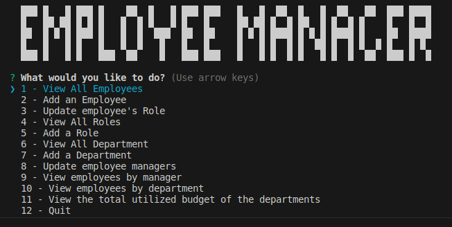

# SVG Logo Maker

Link to the walkthrough video and sample (Google drive) 
```md
https://drive.google.com/drive/folders/15pYxHoI2g0ibWSkIABCGYbZzXAQc-iz-?usp=sharing
```
## Table of Contents
- [Installation](#installation)
- [Acceptance_Criteria](#acceptance_criteria)
- [Helpful](#helpful)
- [License](#license)

## Installation

```
node install && node index.js
```
### User Story

```md
AS a freelance web developer
I WANT to generate a simple logo for my projects
SO THAT I don't have to pay a graphic designer
```

## Acceptance_Criteria

```md
GIVEN a command-line application that accepts user input
WHEN I am prompted for text
THEN I can enter up to three characters
WHEN I am prompted for the text color
THEN I can enter a color keyword (OR a hexadecimal number)
WHEN I am prompted for a shape
THEN I am presented with a list of shapes to choose from: circle, triangle, and square
WHEN I am prompted for the shape's color
THEN I can enter a color keyword (OR a hexadecimal number)
WHEN I have entered input for all the prompts
THEN an SVG file is created named `logo.svg`
AND the output text "Generated logo.svg" is printed in the command line
WHEN I open the `logo.svg` file in a browser
THEN I am shown a 300x200 pixel image that matches the criteria I entered
```


## Helpful SVG Resources

* [Example SVG](https://static.fullstack-bootcamp.com/fullstack-ground/module-10/circle.svg)

* [Scalable Vector Graphics (SVG)](https://en.wikipedia.org/wiki/Scalable_Vector_Graphics)

* [SVG tutorial](https://developer.mozilla.org/en-US/docs/Web/SVG/Tutorial)

* [Basic SVG shapes](https://developer.mozilla.org/en-US/docs/Web/SVG/Tutorial/Basic_Shapes)

* [Text in SVG](https://developer.mozilla.org/en-US/docs/Web/SVG/Tutorial/Texts)

* [SVG VS Code extension](https://marketplace.visualstudio.com/items?itemName=jock.svg)


# challanges

Challenges repository
This is an open source project which has Licensed by MIT which allow you to contribute and used open source codes used in this repo (All Branches).
More info: https://g.co/kgs/QWcHhF

  - Branches are named as module[n] and each one of them its unique challenge.
  - Master Branch contain the last solved challenge. (the read me your are reading trough, it is a defult guid when NO challage availabel to help you do a pre-setup.)
  
 # how to use the module and deploy
 
  - Clone the repo and make it own
      # Https url : 
          git clone https://github.com/miladesmailpour/challanges.git
      # ssh url :
          git clone git@github.com:miladesmailpour/challanges.git
      # Checking the fetch/pull and push url : 
          git remote -v
      # Modifing origin url : 
          git remote add origin [https/ssh url of you repo] https://docs.github.com/en/get-started/quickstart/create-a-repo
      # Verifing the fetch/pull and push url : 
          git remote -v https://docs.github.com/en/get-started/getting-started-with-git/managing-remote-repositories
      # Chacking the status of local : 
          git status
          
          "if local NOT updated"
          git add .
          git commit -m "[your comment]"
          git push origin master/main
   
   - Checkout to the module (the challenge you want to used and deploy)
      # Checkout to the disred challage : 
          git checkout module[n]
      # Verifing : 
          git status
      # [Make the change you wish to have]
          What do you think needed to improve?
      # Commiting to local and updating the GitHub repo: 
            git add .
            git commit -m "[your comment]"
            git push origin [your module name]
  - Moving Modules to Master Branch and deploy :
      # Creating a pull request to update the master/main : 
         https://docs.github.com/en/pull-requests/collaborating-with-pull-requests/proposing-changes-to-your-work-with-pull-requests/creating-a-pull-request
      # Deploy through the GitHub : 
         https://docs.github.com/en/pages/getting-started-with-github-pages/configuring-a-publishing-source-for-your-github-pages-site


